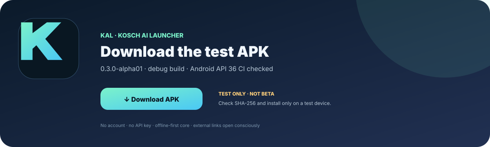
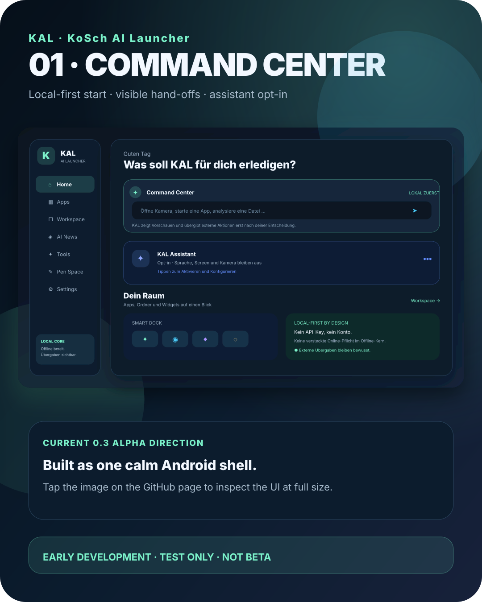
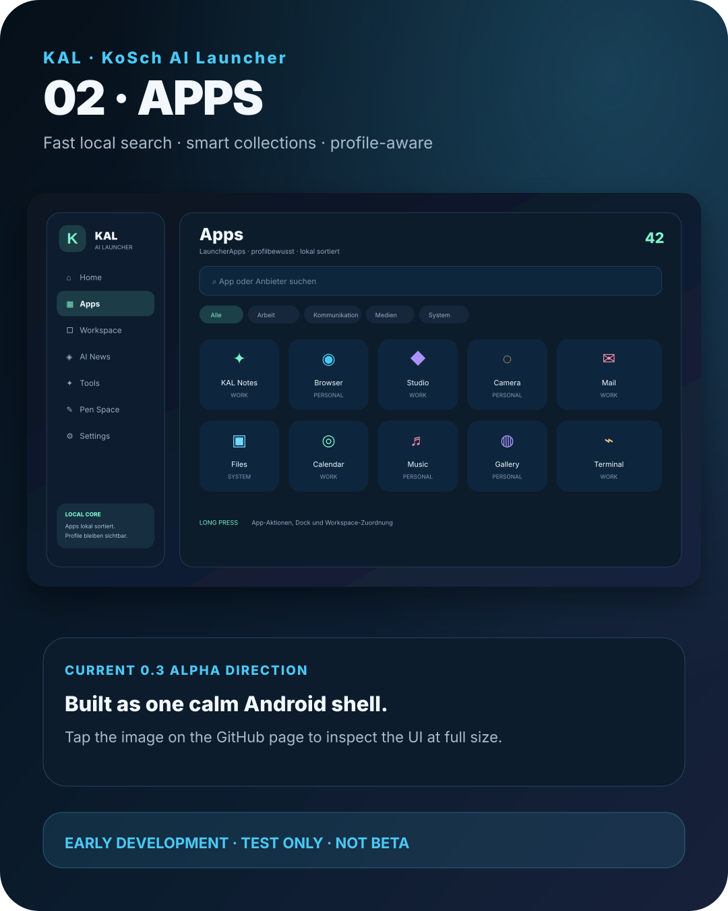
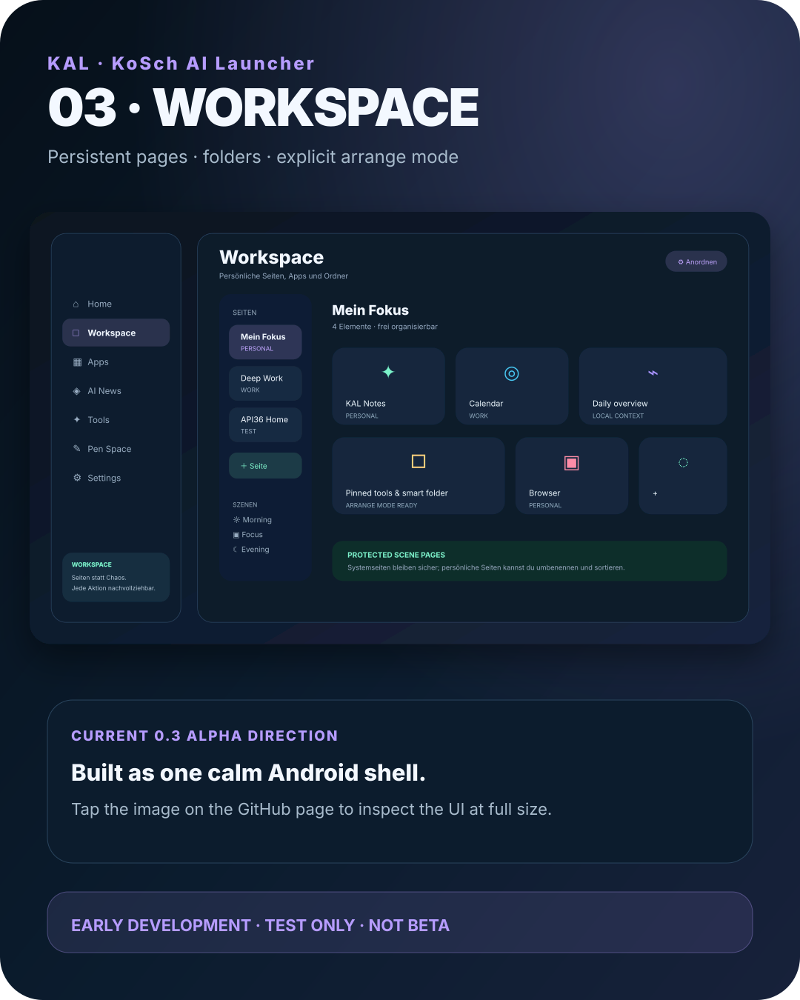
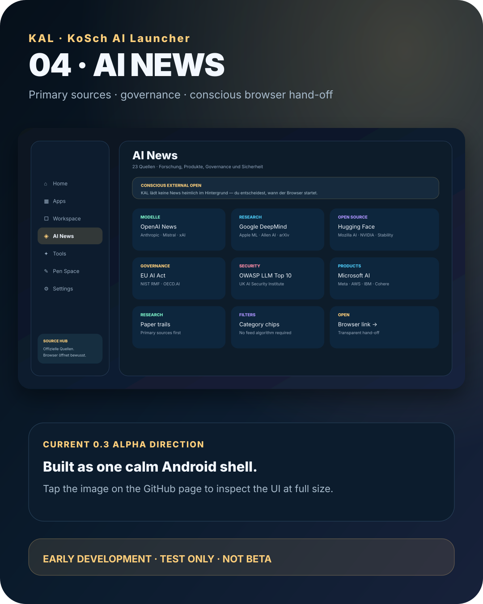
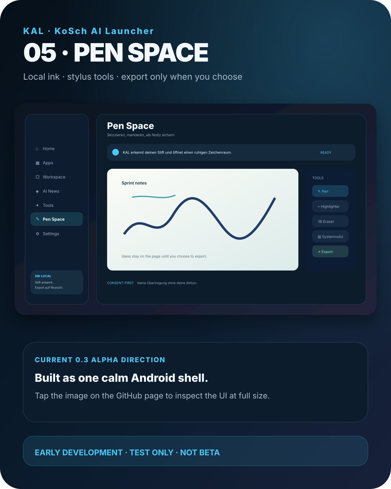

# KAL – KoSch AI Launcher

> **Development warning · test only · not beta:** KAL `0.3.0-alpha01` is an early development snapshot and is not even at beta stage. It is not a production launcher. Install it only on a test device or emulator, keep a second launcher available and back up anything important.

KAL is a native Android launcher built around one calm, professional shell: a local Command Center, searchable Apps, persistent Workspace pages, an explicit AI News source hub, practical Tools, Pen Space and Settings. The offline core works without an account, API key or model download. Assistant, screen awareness and camera awareness are opt-in and disabled by default.

The product target is ambitious; the current quality claim is deliberately modest. This repository contains a usable development build, not a promise that KAL is “the best launcher ever” or ready for daily use.

[](https://github.com/chekento/kosch-ai-android/actions/workflows/android.yml) [](docs/VERSIONS.md) [](LICENSE)

## Download the test APK

The verified `0.3.0-alpha01` artifact is available directly for the current PR build; the workflow page remains the stable entry for future builds. Download the APK together with its `.sha256` checksum. GitHub may require sign-in for Actions artifacts.

[](https://github.com/chekento/kosch-ai-android/actions/runs/35796850880/artifacts/10724995627)

- [Download verified 0.3.0-alpha01 APK and checksum](https://github.com/chekento/kosch-ai-android/actions/runs/35796850880/artifacts/10724995627)
- [Open the future/latest workflow entry](https://github.com/chekento/kosch-ai-android/actions/workflows/android.yml)
- [Open the version archive](docs/VERSIONS.md)
- [Read the disclaimer before installing](docs/DISCLAIMER.md)

## What makes KAL different

| 🧭 | Focus | Benefit |
|---|---|---|
| ✦ | **One professional shell** | Home, Apps, Workspace, AI News, Tools, Pen Space and Settings share one understandable information architecture. |
| 🧠 | **Local Command Center** | Local app/system routes remain useful even without a model or network. External hand-offs are explicit. |
| 🧩 | **Workspace pages** | Personal pages, folders and items are arranged intentionally instead of competing as several hidden home modes. |
| 🛡️ | **Consent-first Assistant** | Assistant, Screen Awareness and Camera Awareness are off until the user opts in. |
| 📰 | **AI News with primary sources** | Research, product, governance and security links are grouped and opened consciously in the browser. |
| ✒️ | **Pen Space** | Stylus ink, system-note route and optional export stay in a focused surface. |
| ♻️ | **Recovery is a feature** | HOME selection, backup/restore, audit export, undo paths and a visible security exit remain reachable. |

## Launcher screenshots

The launcher views are now presented as large store-style screenshots. The interactive GitHub Pages gallery supports horizontal wheel/trackpad scrolling, touch swipe, snap-to-card navigation, arrow buttons, position dots and full-size zoom.

**[Open the Play-Store-style screenshot wheel →](https://chekento.github.io/kosch-ai-android/#screenshots)**

<p align="center">
  <a href="https://chekento.github.io/kosch-ai-android/#screenshots"></a>
</p>

<p align="center">
  <a href="docs/assets/screenshots/kal-store-02-apps.svg"></a>
  <a href="docs/assets/screenshots/kal-store-03-workspace.svg"></a>
</p>

<p align="center">
  <a href="docs/assets/screenshots/kal-store-04-ai-news.svg"></a>
  <a href="docs/assets/screenshots/kal-store-05-pen-space.svg"></a>
</p>

The images document the current KAL shell and remain deliberately marked as an early development / test-only build rather than a finished Play Store release.

## Feature map

### Home and Command Center

- Calm start screen with one local command field and clear next actions.
- App launch, phone, camera, calendar, file inspection, contact and widget routes remain available without an LLM.
- Local context can show time, battery, network and a suggested scene without pretending to be autonomous intelligence.
- Smart Dock, folders and personal Workspace stay visible instead of being hidden behind a mode switch.

### Apps

- `LauncherApps` catalog with search, profile-aware labels, work badges and deterministic local ranking.
- Smart collections for all, work, communication, media, system and frequently/last-used routes.
- Long-press actions for launch, app info, store, Dock, folder, visibility and Android's own uninstall flow.
- Paused work apps stay visibly paused and are not silently launched.

### Workspace

- Persistent user pages with create, rename, reorder, delete and explicit arrange controls.
- Apps and folders can be added as portable Workspace items.
- Scene pages remain protected; user-created pages remain editable.
- Backup, restore, validation and undo boundaries keep the surface recoverable.

### Assistant and awareness

- Assistant entry is opt-in and can remain disabled forever.
- No API key, account or model download is needed for the offline core.
- Screen and camera awareness are consent-first; no hidden always-on observation.
- Capability routes use visible previews and confirmations for actions that leave KAL.

### AI News, Tools and Pen Space

- 23 named sources across models, research, open source, products, security and governance.
- News links open in the external browser only after the user chooses them; the offline APK does not gain a hidden feed permission.
- Tools group phone, files, widgets, calendar, camera, backups, audit, security and help.
- Pen Space supports local vector ink, pen/marker/eraser, undo, autosave and optional SVG export.

## Comparison with other Android launchers

This is a **scope comparison**, not a neutral lab benchmark. `●` means the capability is a named part of the product's current public positioning or KAL's current implementation; `◐` means a related or narrower route exists; `—` means it is not a stated focus in this comparison. A dash never proves that a product cannot do something through Android, an add-on or a newer release. Features change; verify each vendor's current documentation before making a decision.

| Launcher | 🧠 Command / AI | 🛡️ Local / privacy | 🧩 Workspace / pages | 🛠️ System / pro tools | ✒️ Pen / desktop | 📰 AI news / governance | 🎛️ Customizing | Short profile |
|---|:---:|:---:|:---:|:---:|:---:|:---:|:---:|---|
| **KAL – KoSch AI** | ● | ● | ● | ● | ● | ● | ◐ | Unified local-first shell; current target and test build. |
| Pixel Launcher | ◐ | ◐ | ◐ | ◐ | — | — | ◐ | Google/Pixel home experience and system integration. |
| Samsung One UI Home | ◐ | ◐ | ◐ | ● | ◐ | — | ◐ | OEM launcher with device, widget and Galaxy integration. |
| Nova Launcher | — | ◐ | ● | ◐ | — | — | ● | Deep layout and customization control. |
| Niagara Launcher | ◐ | ● | ◐ | — | — | — | ◐ | Focused one-hand list and calm home philosophy. |
| Microsoft Launcher | ◐ | ◐ | ◐ | ● | — | — | ◐ | Productivity and Microsoft-service oriented home. |
| Lawnchair | — | ● | ◐ | ◐ | — | — | ◐ | Open-source, Pixel-inspired launcher direction. |
| Smart Launcher 6 | ◐ | ◐ | ● | ◐ | — | — | ● | Automatic app organization and broad customization. |
| POCO Launcher | — | ◐ | ◐ | ◐ | — | — | ◐ | Xiaomi/POCO-oriented app drawer and performance focus. |
| Nothing Launcher | — | ◐ | ◐ | — | — | — | ◐ | Minimal Nothing device experience. |
| Olauncher | — | ● | — | — | — | — | — | Text-first minimal, distraction-reducing home. |
| Ratio | ◐ | ◐ | ◐ | — | — | — | ● | Productivity-oriented dashboard and visual organization. |
| AIO Launcher | ◐ | ◐ | ◐ | ◐ | — | — | ◐ | Information-dense, widget-like home dashboard. |
| KISS Launcher | — | ● | — | — | — | — | ◐ | Fast, text-driven open-source launcher. |
| Before Launcher | — | ◐ | — | — | — | — | ◐ | Minimalist, notification-conscious home. |
| Indistractable Launcher | — | ● | — | — | — | — | — | Distraction-free launcher positioning. |
| Hyperion Launcher | — | ◐ | ● | ◐ | — | — | ● | Launcher3-based customization route. |
| Total Launcher | — | ◐ | ● | ◐ | — | — | ● | Highly configurable layout and theming. |
| Action Launcher | — | ◐ | ● | ◐ | — | — | ● | Pixel-inspired customization with shortcuts and panels. |
| ASUS / ZenUI Launcher | — | ◐ | ◐ | ◐ | — | — | ◐ | OEM launcher and device utility integration. |
| AOSP Launcher3 | — | ● | ◐ | — | — | — | — | Android reference launcher foundation. |

### How to read the comparison

KAL is not trying to win every customization contest or replace every OEM utility. Its differentiator is the combination of a calm shell, local-first command entry, persistent workspaces, opt-in assistant boundaries, a primary-source AI hub and a pen-capable surface. The trade-off is maturity: KAL is much earlier than the established launchers listed above.

Public product starting points used for the positioning check: [Nova](https://novalauncher.com/), [Niagara](https://niagaralauncher.com/), [Microsoft Launcher](https://www.microsoft.com/en-us/launcher), [Lawnchair](https://lawnchair.app/), [KISS](https://kisslauncher.com/), [AOSP Launcher3](https://android.googlesource.com/platform/packages/apps/Launcher3/) and [Olauncher](https://www.olauncher.com/). This list is context, not an endorsement or a claim of feature completeness.

## Build and test

Requirements: JDK 17, Android SDK 36, Android Studio/AGP 8.13.

```bash
./gradlew testDebugUnitTest lintDebug assembleDebug assembleRelease
```

The local debug APK is `app/build/outputs/apk/debug/app-debug.apk`. The CI package contains:

- `KAL-AI-Launcher-0.3.0-alpha01-debug.apk`
- `KAL-AI-Launcher-0.3.0-alpha01-debug.apk.sha256`

The current offline manifest intentionally contains no `INTERNET` or `RECORD_AUDIO` permission. Android system surfaces, the external browser and installed apps retain their own behavior and data policies.

## Documentation and archive

- [Adaptive product portal](docs/index.html) — English by default; German when the browser language starts with `de`.
- [Changelog](docs/CHANGELOG.md) · [adaptive Changelog](docs/changelog.html)
- [Versions and APK archive](docs/VERSIONS.md) · [adaptive versions page](docs/versions.html)
- [Disclaimer / Haftungsausschluss](docs/DISCLAIMER.md) · [adaptive disclaimer](docs/disclaimer.html)
- [Architecture](docs/ARCHITECTURE.md)
- [FAQ](docs/FAQ.md)
- [Security and privacy](docs/SECURITY.md)
- [Quality gates](docs/QUALITY_GATES.md)
- [Roadmap](docs/ROADMAP.md)

## Deutsch

KAL – KoSch AI Launcher ist eine native Android-Shell für professionelle Nutzer: Home, Apps, Workspace, AI News, Tools, Pen Space und Settings liegen in einer verständlichen Oberfläche. Der Offline-Kern funktioniert ohne Konto, API-Key oder Modelldownload. Assistant, Screen Awareness und Camera Awareness bleiben standardmäßig aus und werden nur per Opt-in aktiviert.

Der aktuelle Stand `0.3.0-alpha01` ist **noch nicht einmal Beta**, sondern ein Teststand. Nur auf Testgeräten installieren, einen Fallback-Launcher bereithalten und wichtige Daten sichern. Der [Haftungsausschluss](docs/DISCLAIMER.md) ist vor der Installation zu lesen.

Die vollständige zweisprachige Darstellung, fünf In-App-Ansichten, Icon, APK-Karte und drei Banner sind oben dokumentiert. Für die automatische Sprachauswahl nutzt du das [adaptive Portal](docs/index.html); GitHub-Markdown selbst führt kein JavaScript aus und bleibt daher zweisprachig mit Englisch zuerst.

## Repository information / Repository-Informationen

<details>
<summary>Expand technical repository information</summary>

### Technical frame

- Package: `cloud.kosch.aiandroid`
- Product name: `KAL – KoSch AI Launcher`
- Version: `0.3.0-alpha01` · Version Code `8`
- minSdk `29` · targetSdk / compileSdk `36`
- Kotlin `2.3` · Jetpack Compose · Material 3
- Gradle `8.13` · Android Gradle Plugin `8.13`
- License: Apache-2.0
- Offline permission budget: `ACCESS_NETWORK_STATE`, `CAMERA`, `FOREGROUND_SERVICE`, `FOREGROUND_SERVICE_MEDIA_PROJECTION`
- Main source surface: `app/src/main/java/cloud/kosch/aiandroid/ui/KALLauncherShell.kt`
- Legacy implementation remains below the shell as focused task surfaces and recovery paths.

### Quality discipline

The former M2.5 comparison scored the implementation at 8.2/10 overall and did not reach the 9.5 target. That score is not silently increased for the 0.3 shell. Real OEM, foldable, accessibility, stylus, performance, release-signing and independent security evidence are still outstanding.

### Navigation and recovery

KAL can be selected as Android HOME, but the control center keeps the Android default-home route and a visible security exit reachable. App uninstall, phone, files, widgets, calendar, camera and external links use Android's own contracts; KAL does not pretend to own the whole operating system.

</details>
