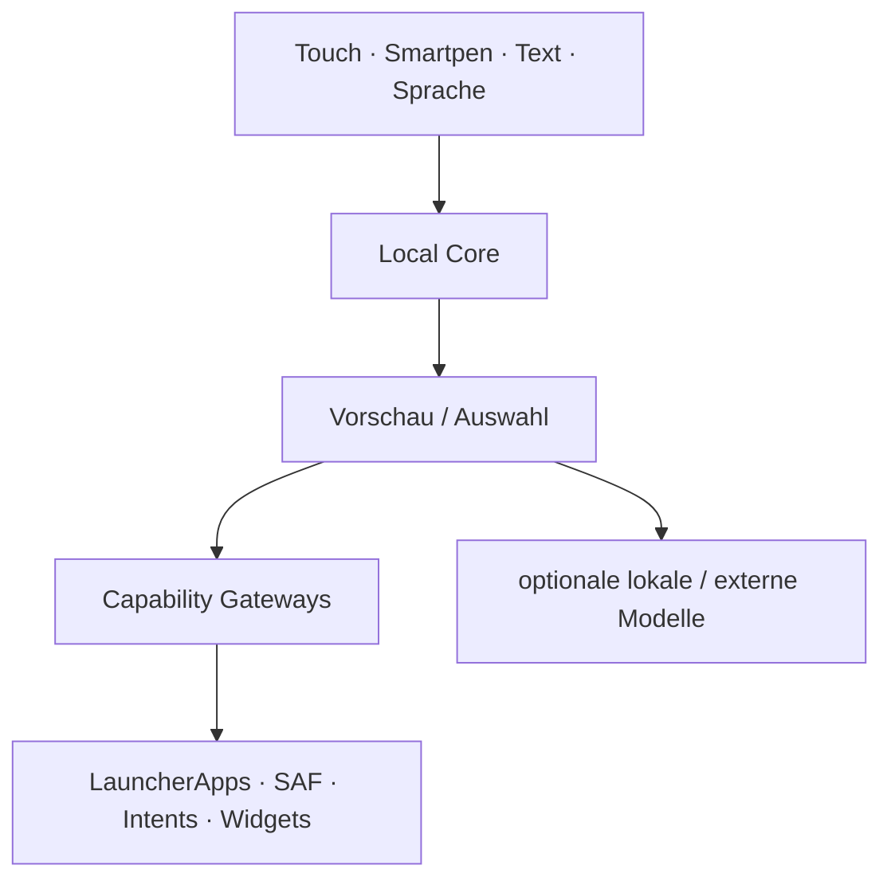
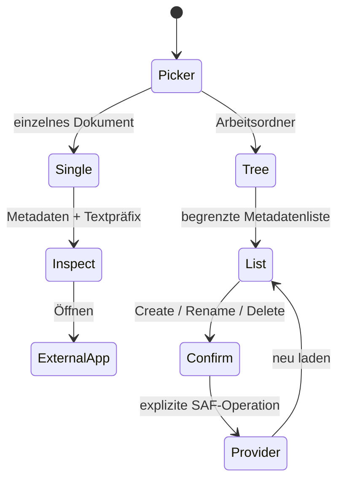
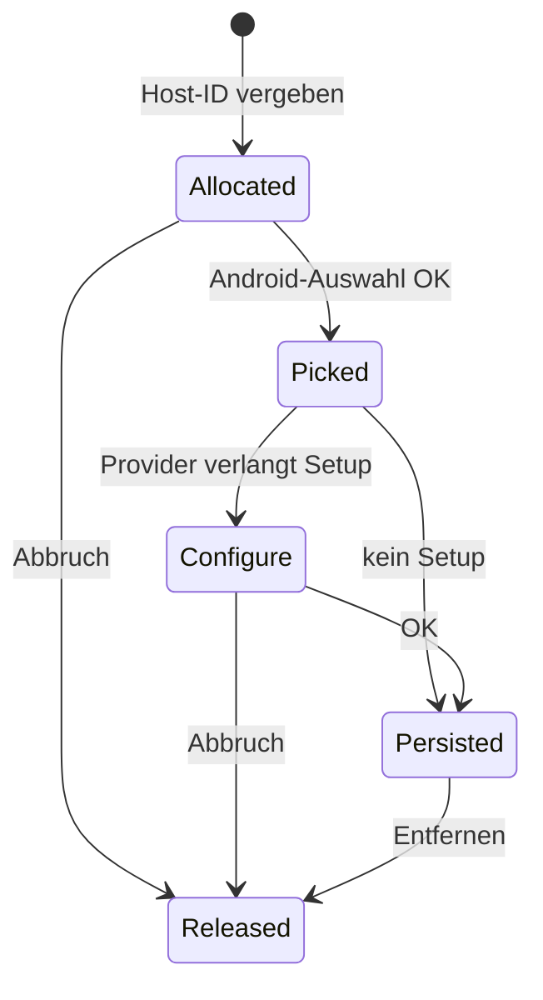
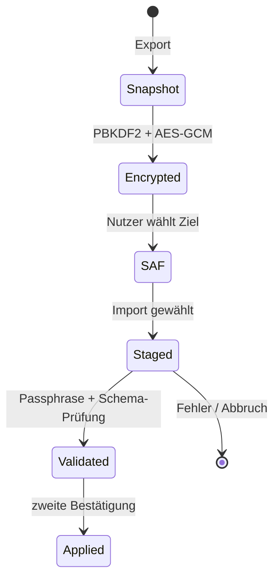
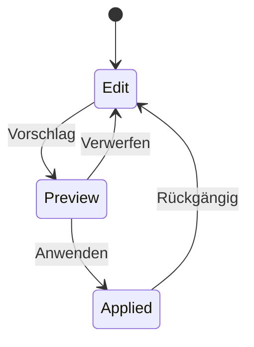

# Architektur

## Leitidee

KoSch ist zuerst eine ausfallsichere Android-HOME-Shell. KI ist ein Orchestrator unter Eingabe, Kontext, Suche, Dateien, Aktionen und Workspace-Mutationen. Fällt ein Modell oder Provider aus, müssen App-Start, Telefon, Dateien, Widgets, Einstellungen und die HOME-Auswahl weiterhin funktionieren.

M2.4 ergänzt belastbare Lifecycle-Grenzen, lokale Personalisierung, einen eng begrenzten Datei-Arbeitsraum, sichere App-Verwaltung, Widget-Reihenfolge/Undo und exportierbare Pen-Vektoren. Generative Modelllaufzeiten sind registrierte, aber noch nicht in den HOME-Prozess geladene Erweiterungen.

## Gegenwärtige Paketgrenzen

| Paket | Verantwortung | Vertrauensniveau |
|---|---|---|
| `model` | Workspace-, Professional-, Audit-, Datei-, Shortcut-, Profil-, FAQ-, Stylus- und Ink-Modelle | rein |
| `data` | App-/Shortcut-/FAQ-Katalog, Workspace-Schema v6, Migration, Pending-Exports, Audit, Dock-/Ordner-/Ink-/Widget-Persistenz | lokal |
| `ai` | Befehlsplanung, Suche, lokales Nutzungsranking, Datei-Metadatenanalyse, Smart-Dock-/Ordner-Klassifikation, Runtime-/Providerprofile | lokal; keine Netzschicht |
| `system` | HOME-Rolle, Kontext, Stylus-Monitor, Dialer/Settings/File-Gateways, Dokument-/Tree-Grant-Owner, Badge Listener, Widget Host | Android-Grenze |
| `security` | portabler Backup-Codec, Endpoint-Policy und ruhender Keystore-Vault | Secret-Grenze |
| `ui` | Compose-Shell, Onboarding, Sheets, Neural Glass, Bestätigungen | Darstellung |
| `LauncherViewModel` / `LauncherController` | Lifecycle-Eigentum, explizite Orchestrierung und UI-Zustand | Application Layer |

Ein Modulsplit folgt, sobald der native Modelladapter oder ein optionaler Netzwerkadapter hinzukommt. Besonders `ai-network` darf später als eigener Build Flavor/Modul das `INTERNET`-Recht besitzen; der offline Kern behält es nicht automatisch.

## Lifecycle- und Prozessgrenze

`MainActivity` bezieht `LauncherController` aus `LauncherViewModel`. Dadurch werden Store, Listener, Widget Host und Single-Thread-Worker bei Rotation, Window Resize oder Fold-Transition nicht dupliziert; `onCleared` schließt sie erst endgültig. Ein ViewModel allein überlebt keinen echten Prozess-Tod.

Für offene `CreateDocument`-Routen trennt M2.4 deshalb Payload und UI-State: `PendingDocumentStore` schreibt Backup, Audit oder SVG atomar und größenbegrenzt in `noBackupFilesDir`; `onSaveInstanceState` hält nur einen zufälligen, typgebundenen Token. Nach einem neuen Prozess wird genau dieses Payload einmal konsumiert, andernfalls verworfen oder nach 24 Stunden bereinigt. Offene Widget-/Kontakt-/Tree-Picker behalten nur die minimal notwendigen IDs/Activity-Result-Zustände. Vollständige OEM-Prozess-Tod-Tests bleiben ein manuelles Gate.

## HOME und Sicherheitsausgang

`RoleManager.ROLE_HOME` öffnet ausschließlich Androids geschützten Rollendialog. Zusätzlich ist `Settings.ACTION_HOME_SETTINGS` im Onboarding und Kontrollzentrum erreichbar. Der Fallback ist `Settings.ACTION_SETTINGS`. KoSch fängt die Zurück-Taste nicht ab, um einen Lock-in zu erzeugen.

## Adaptive Shell und Designsystem

`LauncherRoot` leitet die Darstellung aus den aktuellen `BoxWithConstraints`-Fenstermaßen ab. Kompakte Fenster verwenden eine vertikale Shell; ab 840 dp beziehungsweise ab 720 dp im Querformat werden Navigation und Arbeitsfläche getrennt. Die Entscheidung hängt nicht an einer einmal ermittelten Displayklasse und reagiert deshalb auf Rotation, Multi-Window und Foldable-Resize.

Android 12+ liefert `dynamicDarkColorScheme`; ältere Versionen erhalten die kuratierte KoSch-Palette. Systemleisten bleiben edge-to-edge mit Inset-Schutz. Die Animator-Dauer des Systems steuert den statischen Reduced-Motion-Fallback. App- und Dock-Kacheln besitzen zusammengeführte Button-Semantik; Pen Space veröffentlicht Undo und Clear als Accessibility-Custom-Actions. TalkBack-, Switch-, Screenshot-, 320-dp-, Hinge- und 200-%-Schrifttests bleiben dennoch ein Geräte-Gate.

Ein konservatives `baseline-prof.txt` markiert ausschließlich den nachweislich startkritischen HOME-/Controller-/Store-/Compose-Pfad. Das ist ein Installationshinweis für ART, kein Performance-Beweis. Startzeit, Jank, RSS, Akku und Pen-Latenz bleiben erst nach Macrobenchmark auf realen Geräteklassen bewertbar.

## Pro Desk und Hardware-Tastatur

`ProfessionalHubSurface` ist die Standard-Home-Seite neuer Installationen. Sie aggregiert nur bereits begrenzte Controller-Zustände: HOME-Lage, Local-Core-Status, zugängliche Work-App-Anzahl, Audit-Anzahl, Smart-Dock-Apps und explizite Capability-Einstiege. `ProfessionalShortcutResolver` ist eine reine, unit-getestete Zuordnung. `MainActivity.onKeyShortcut` führt ausschließlich bekannte Aktionen aus; `onProvideKeyboardShortcuts` veröffentlicht sie an Android. Escape schließt über `closeTopSurface` genau den obersten transienten Zustand.

## App-Katalog und Shortcuts

Startbare Activities kommen für jedes zugängliche `LauncherApps.profiles`-Profil aus `LauncherApps.getActivityList`; Apps werden mit `startMainActivity` für den zugehörigen `UserHandle` gestartet. Der stabile App-Schlüssel enthält eine lokale Benutzer-Seriennummer, damit gleichnamige Pakete aus Personal und Work nicht kollidieren. `AppKeyMigration` übersetzt alte `UserHandle.hashCode`-Schlüssel erst nach Laden des realen Katalogs; mehrdeutige Zuordnungen werden nicht geraten. Icons werden über Android gebadgt; Arbeitsprofile erhalten zusätzlich ein sichtbares Label.

Veröffentlichte dynamische, Manifest- und gepinnte Shortcuts werden erst nach langem Druck gelesen und mit `LauncherApps.startShortcut` gestartet. Der Aktionsraum bietet zusätzlich App-Info, Store, Dock/Ordner, lokales Verbergen und Androids sichtbaren Deinstallationsdialog. „Verborgen“ ist eine Launcher-Präferenz, keine Android-Sicherheitsgrenze. Der Launcher liest keine privaten Shortcut-Intents und fordert weder `QUERY_ALL_PACKAGES` noch `ACCESS_HIDDEN_PROFILES` an.

## Smartpen und Pen Space

`StylusMonitor` registriert einen `InputManager.InputDeviceListener` und erkennt `SOURCE_STYLUS`, `SOURCE_BLUETOOTH_STYLUS`, `TOOL_TYPE_STYLUS` sowie `TOOL_TYPE_ERASER`. MotionEvents aktualisieren Druck, Neigung, Orientierung, Hover, Werkzeugtyp und Stifttasten mit gedrosselten UI-Samples. Herstellername, Vendor-/Product-ID oder Seriennummer werden nicht persistiert.

`PressureInkView` akzeptiert ausschließlich Stylus-/Eraser-Werkzeuge und ignoriert Fingerkontakte. Druck verändert die Strichbreite; Stift, Marker, Hardware-/Software-Radierer, Hover, Undo und Clear sind lokale Operationen. Striche werden als normierte Vektorpunkte persistiert, begrenzt auf 100 Striche und 2.048 Punkte je Strich. Sehr lange Eingaben werden gleichmäßig resampled; Anfang und sichtbarer Endpunkt bleiben erhalten. `InkSvgExporter` erzeugt lokal eine portable SVG-Datei über den normalen Android-Zieldialog.

Systemhandschrift in regulären Compose-Textfeldern bleibt eine Android-14+-IME-Funktion. KoSch behauptet weder eigene OCR noch semantisches Verständnis der Ink-Daten. AndroidX Ink ist eine spätere, benchmarkpflichtige Option, keine versteckte Kernabhängigkeit.

## FAQ und Self-Service

`FaqRegistry` enthält mehr als 50 versionierte, kategorisierte Einträge einschließlich Professional-, Datei-, App-, Backup-, Kontakt-, Audit-, Pen- und Recovery-Themen. Die Suche normalisiert Großschreibung, Diakritika und Trennzeichen vollständig lokal. `LocalCommandPlanner` kann diese Arbeitsbereiche ohne Modell öffnen. Die ausführliche Entwickler-/Betriebsfassung liegt in `docs/FAQ.md`.

## Dateien und begrenzter Arbeitsraum

Die Einzeldatei-Route nutzt `ACTION_OPEN_DOCUMENT`. `DocumentGrantManager` besitzt höchstens eine persistierte READ-URI-Freigabe; `LocalFileIntelligenceEngine` liest Metadaten sowie maximal 4.096 Zeichen aus bekannten Textformaten. Binärdateien werden nicht als Text geraten.

Der zusätzliche `WorkspaceTreeManager` besitzt genau eine persistierte READ/WRITE-Freigabe aus `ACTION_OPEN_DOCUMENT_TREE`. Er kann nur den gewählten Baum und dessen Kinder adressieren, listet höchstens 500 direkte Einträge und zeigt Rename/Delete/Create nur bei passenden Provider-Flags. `LocalFileWorkspacePlanner` analysiert ausschließlich sichtbare Metadaten: Kategorien, bekannte Größe, gleichnamige Einträge und größte Dateien. Erstellen und Umbenennen verlangen Vorschau/Bestätigung; nur die letzte Umbenennung hat Undo. Löschen verlangt einen separaten destruktiven Dialog und hat kein vorgetäuschtes KoSch-Undo. Wechsel oder „Vergessen“ löst die persistierte Freigabe.

## Telefon und Systemeinstellungen

`SystemActionGateway` kennt nur explizite, dokumentierte Android-Ziele. Telefon verwendet `ACTION_DIAL`, nie `ACTION_CALL`. Die Activity startet eine auf Phone-Daten begrenzte `ACTION_PICK`-Auswahl und setzt auf API 37 den System-Picker-Hinweis; der Controller fragt nur die temporär freigegebene Ergebnis-URI ab. WLAN, Bluetooth, Benachrichtigungen, Hintergrund, Anzeige, Ton, Akku, Datenschutz, Bedienungshilfen, Standard-Apps, Speicher, App-Info und HOME-Auswahl öffnen Systemoberflächen. Fehlt ein spezielles Ziel, folgt ein allgemeiner Settings-Fallback oder ein sichtbarer Fehler.

## Widgets

`WidgetHostController` besitzt eine stabile Host-ID. Erst nach erfolgreicher Bindung wird die Widget-ID im Workspace Store persistiert. Abbruch und Löschen geben IDs frei. Beim Start werden nicht mehr gültige Records entfernt. M2.4 persistiert die Presets Kompakt, Standard und Hoch, meldet Größenoptionen an den Provider und unterstützt eine persistente Board-Reihenfolge mit einem gültigkeitsgeprüften Undo. Freie Platzierung, Stacks und geräteübergreifendes Provider-Restore-Mapping sind noch nicht fertig.

Die während Androids Picker/Provider-Konfiguration offene Host-ID wird zusätzlich in `onSaveInstanceState` erhalten. Vollständige Prozess-Tod-, OEM-Provider- und geräteübergreifende Restore-Tests bleiben ein manuelles Gate.

## Backup, Restore und Audit

`WorkspaceStore` serialisiert nur portable Werte. `PortableBackupCodec` authentifiziert Header und Payload. `LauncherViewModel` besitzt den Controller über Activity-Recreation hinweg. Für Backup-, Audit- und SVG-Export legt `PendingDocumentStore` höchstens 8 MiB in einer privaten No-Backup-Datei ab; Saved State enthält nur einen zufälligen Einmaltoken. Nach Konsum, Abbruchbereinigung oder spätestens 24 Stunden wird das Staging gelöscht. Restore wird nach vollständiger Validierung in einem synchronen Commit angewendet. `LocalAuditLog` verwendet ein geschlossenes Enum-Schema ohne Ziel- oder Freitextdaten.

## Smart Space, Dock und Ordner

`LocalSmartOrganizer` verarbeitet ausschließlich App-Key, Label, Paketname, lokale Recency, Pinning und aktive Szene. `LocalUsageModel` hält pro App nur begrenzte Startanzahl und letzten Startzeitpunkt (maximal 512 Schlüssel) und kann vollständig zurückgesetzt werden. Der App-Raum bietet Smart, A–Z, Häufig und Zuletzt. Das Dock setzt manuell gepinnte Apps zuerst und ergänzt transparent lokale Signale sowie Szenenkategorien. Verborgene Apps werden aus normalen Sammlungen entfernt, bleiben aber in einer expliziten Verwaltungsansicht erreichbar.

App-Shortcut-Abfragen tragen einen monotonen Request-Token. Wechselt die Auswahl oder schließt sich das Sheet, darf ein verspätetes Ergebnis den Zustand nicht mehr überschreiben.

## Notification Dots

`KoSchNotificationListenerService` ist opt-in und durch Androids `BIND_NOTIFICATION_LISTENER_SERVICE` geschützt. Der Launcher kopiert ausschließlich Paketname und Anzahl aktiver, nicht laufender, nicht gruppenzusammenfassender und laut `Ranking.canShowBadge()` badgefähiger Notifications in einen prozesslokalen Zähler. Titel, Text, Extras, Personen und Aktionen werden nicht gespeichert. Ohne erteilten Zugriff ist die Map leer; alle anderen HOME-Funktionen bleiben aktiv.

## Workspace-Mutationen

Positionen sind zwischen `0` und `1` normalisiert. Jede spätere LLM-generierte Mutation muss dieselbe Preview-/Apply-/Undo-Schiene nutzen; direkte Modellschreibrechte am Store sind ausgeschlossen.

## KI-Schichten

| Schicht | M2.4 | Verhalten bei Ausfall |
|---|---:|---|
| KoSch Local Core | aktiv | HOME-Funktionen bleiben deterministisch |
| externe lokale App | optional | Projektseite oder sichtbarer Fehler |
| natives On-Device-LLM | noch nicht gebündelt | Local Core übernimmt |
| Cloud-App/Web | explizite Übergabe | Launcher bleibt lokal |
| direkte API | deaktiviert | kein `INTERNET`-Recht vorhanden |

Die Zielabstraktion `LocalModelBackend` erhält später `load`, `stream`, `cancel`, `unload` und `health`. Modellinferenz darf nicht den UI-/HOME-Prozess blockieren. Geräteprobe, Speicherlimit, Thermalstatus, Modelllizenz und ein hartes Timeout sind Teil des Load-Gates.

## Credential Vault

`SecureCredentialVault` generiert einen nicht exportierbaren AES-256-Schlüssel im Android Keystore und bindet Ciphertexte per GCM-AAD an die Provider-ID. Klartext wird nicht persistiert; übergebene `CharArray`s werden bestmöglich geleert. `ProviderEndpointPolicy` erlaubt Remote-Endpunkte nur per HTTPS und unverschlüsseltes HTTP ausschließlich für explizit aktivierte Loopback-Ziele.

Der Vault ist in M2.4 absichtlich nicht an UI oder Transport gekoppelt. Das lokale Aktionsaudit ist keine Freigabe für Netztransport. Vor Aktivierung direkter APIs fehlen weiter Biometrieoption, Secret-Rotation, Redaction-E2E-Tests, Kontextvorschau, Timeout/Rate Limits und ein separater Netzwerk-Flavour.
