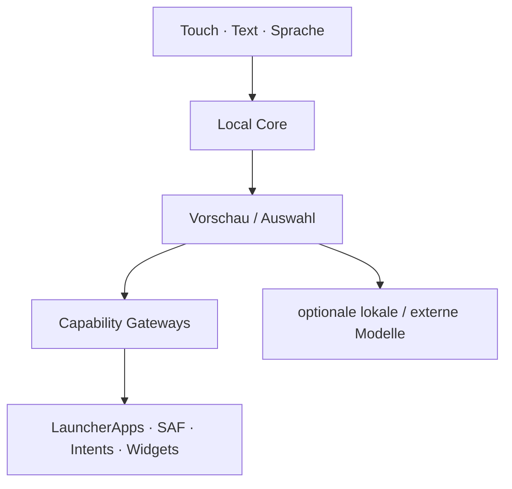
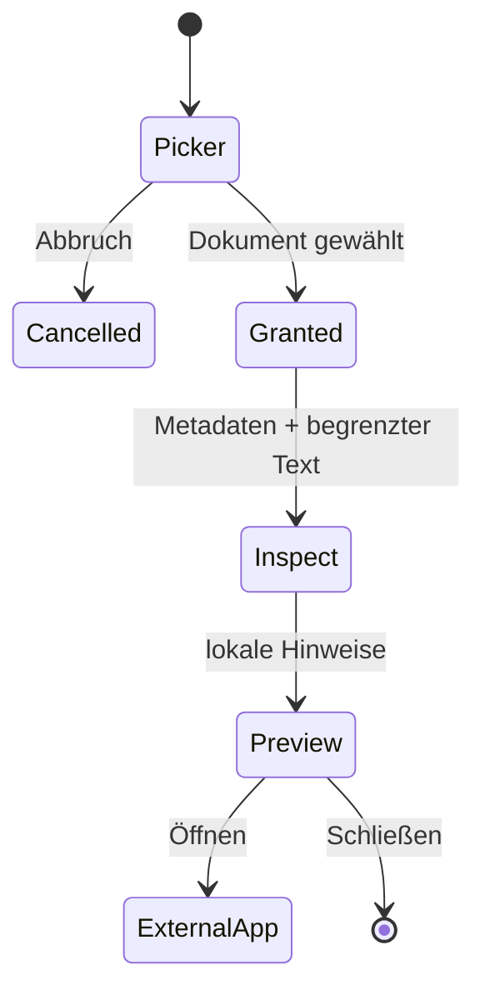
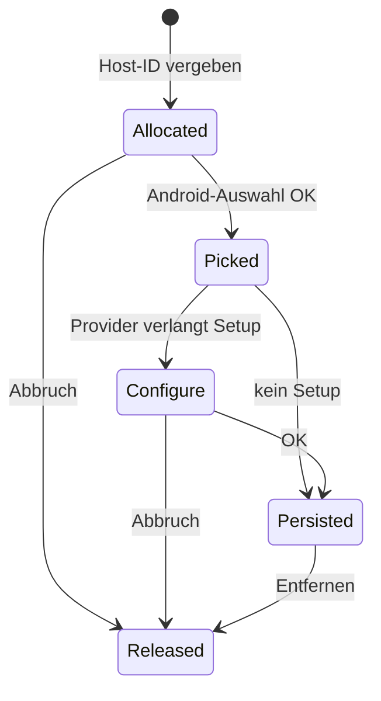
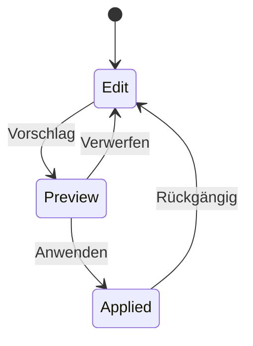

# Architektur

## Leitidee

KoSch ist zuerst eine ausfallsichere Android-HOME-Shell. KI ist ein Orchestrator unter Eingabe, Kontext, Suche, Dateien, Aktionen und Workspace-Mutationen. Fällt ein Modell oder Provider aus, müssen App-Start, Telefon, Dateien, Widgets, Einstellungen und die HOME-Auswahl weiterhin funktionieren.

M2.1 implementiert `Local Core`, die Android-Gateways und einen persistierten Smart Space. Generative Modelllaufzeiten sind registrierte, aber noch nicht in den HOME-Prozess geladene Erweiterungen.

## Gegenwärtige Paketgrenzen

| Paket | Verantwortung | Vertrauensniveau |
|---|---|---|
| `model` | unveränderliche Workspace-, Datei-, Shortcut- und Systemmodelle | rein |
| `data` | App-/Shortcut-Katalog, versionierter Workspace, Dock-/Ordner- und Widget-ID-Persistenz | lokal |
| `ai` | Befehlsplanung, Suche, Smart-Dock-/Ordner-Klassifikation, Runtime-/Providerprofile | lokal; keine Netzschicht |
| `system` | HOME-Rolle, Kontext, Dialer/Settings/File-Gateways, Grant-Owner, Badge Listener, Widget Host | Android-Grenze |
| `security` | Endpoint-Policy und ruhender Keystore-Vault | Secret-Grenze |
| `ui` | Compose-Shell, Onboarding, Sheets, Neural Glass, Bestätigungen | Darstellung |
| `LauncherController` | explizite Orchestrierung und UI-Zustand | Application Layer |

Ein Modulsplit folgt, sobald der native Modelladapter oder ein optionaler Netzwerkadapter hinzukommt. Besonders `ai-network` darf später als eigener Build Flavor/Modul das `INTERNET`-Recht besitzen; der offline Kern behält es nicht automatisch.

## HOME und Sicherheitsausgang

`RoleManager.ROLE_HOME` öffnet ausschließlich Androids geschützten Rollendialog. Zusätzlich ist `Settings.ACTION_HOME_SETTINGS` im Onboarding und Kontrollzentrum erreichbar. Der Fallback ist `Settings.ACTION_SETTINGS`. KoSch fängt die Zurück-Taste nicht ab, um einen Lock-in zu erzeugen.

## App-Katalog und Shortcuts

Startbare Activities kommen aus `LauncherApps.getActivityList`; Apps werden mit `startMainActivity` gestartet. M2 liest veröffentlichte dynamische, Manifest- und gepinnte Shortcuts erst nach langem Druck und startet sie mit `LauncherApps.startShortcut`. Der Launcher liest keine privaten Shortcut-Intents und fordert kein `QUERY_ALL_PACKAGES` an.

## Dateien

Die Activity nutzt `ACTION_OPEN_DOCUMENT` über den Activity-Result-Vertrag. `DocumentGrantManager` besitzt höchstens eine persistierte READ-URI-Freigabe: Eine neue Wahl ersetzt die alte, und die Oberfläche kann den Zugriff explizit lösen. `LocalFileIntelligenceEngine` liest Metadaten sowie maximal 4.096 Zeichen aus erkannten Textformaten. Binärdateien werden nicht als Text geraten. M2.1 verändert, löscht oder benennt Dokumente nicht um.

## Telefon und Systemeinstellungen

`SystemActionGateway` kennt nur explizite, dokumentierte Android-Ziele. Telefon verwendet `ACTION_DIAL`, nie `ACTION_CALL`. WLAN, Bluetooth, Benachrichtigungen, App-Info, Android-Einstellungen und HOME-Auswahl öffnen Systemoberflächen; Fehler werden abgefangen und sichtbar gemeldet.

## Widgets

`WidgetHostController` besitzt eine stabile Host-ID. Erst nach erfolgreicher Bindung wird die Widget-ID im Workspace Store persistiert. Abbruch und Löschen geben IDs frei. Beim Start werden nicht mehr gültige Records entfernt. M2 hostet Widgets in einem separaten Board; freie Position, Resize, Restore-Mapping und Undo für Widgets sind noch nicht fertig.

Die während Androids Picker/Provider-Konfiguration offene Host-ID wird zusätzlich in `onSaveInstanceState` erhalten. Dadurch geht sie bei Activity-Recreation nicht sofort verloren; vollständige Prozess-Tod- und Provider-Restore-Tests bleiben ein M2.2-Gate.

## Smart Space, Dock und Ordner

`LocalSmartOrganizer` verarbeitet ausschließlich App-Key, Label, Paketname, lokale Recency, Pinning und aktive Szene. Das Dock setzt manuell gepinnte Apps zuerst, danach lokale Recency und szenenspezifische Kategorien. Ordner werden deterministisch vorgeschlagen und als JSON mit Schema-Version persistiert. Erneutes Organisieren nutzt **Vorschau → Anwenden/Verwerfen**; das erste leere Profil wird lokal mit editierbaren Starter-Sammlungen initialisiert.

App-Shortcut-Abfragen tragen einen monotonen Request-Token. Wechselt die Auswahl oder schließt sich das Sheet, darf ein verspätetes Ergebnis den Zustand nicht mehr überschreiben.

## Notification Dots

`KoSchNotificationListenerService` ist opt-in und durch Androids `BIND_NOTIFICATION_LISTENER_SERVICE` geschützt. Der Launcher kopiert ausschließlich Paketname und Anzahl aktiver, nicht laufender, nicht gruppenzusammenfassender Notifications in einen prozesslokalen Zähler. Titel, Text, Extras, Personen und Aktionen werden nicht gespeichert. Ohne erteilten Zugriff ist die Map leer; alle anderen HOME-Funktionen bleiben aktiv.

## Workspace-Mutationen

Positionen sind zwischen `0` und `1` normalisiert. Jede spätere LLM-generierte Mutation muss dieselbe Preview-/Apply-/Undo-Schiene nutzen; direkte Modellschreibrechte am Store sind ausgeschlossen.

## KI-Schichten

| Schicht | M2 | Verhalten bei Ausfall |
|---|---:|---|
| KoSch Local Core | aktiv | HOME-Funktionen bleiben deterministisch |
| externe lokale App | optional | Projektseite oder sichtbarer Fehler |
| natives On-Device-LLM | noch nicht gebündelt | Local Core übernimmt |
| Cloud-App/Web | explizite Übergabe | Launcher bleibt lokal |
| direkte API | deaktiviert | kein `INTERNET`-Recht vorhanden |

Die Zielabstraktion `LocalModelBackend` erhält später `load`, `stream`, `cancel`, `unload` und `health`. Modellinferenz darf nicht den UI-/HOME-Prozess blockieren. Geräteprobe, Speicherlimit, Thermalstatus, Modelllizenz und ein hartes Timeout sind Teil des Load-Gates.

## Credential Vault

`SecureCredentialVault` generiert einen nicht exportierbaren AES-256-Schlüssel im Android Keystore und bindet Ciphertexte per GCM-AAD an die Provider-ID. Klartext wird nicht persistiert; übergebene `CharArray`s werden bestmöglich geleert. `ProviderEndpointPolicy` erlaubt Remote-Endpunkte nur per HTTPS und unverschlüsseltes HTTP ausschließlich für explizit aktivierte Loopback-Ziele.

Der Vault ist in M2 absichtlich nicht an UI oder Transport gekoppelt. Vor Aktivierung direkter APIs fehlen noch Biometrieoption, Secret-Rotation, Redaction-E2E-Tests, Kontextvorschau, Audit, Timeout/Rate Limits und ein separater Netzwerk-Flavour.
