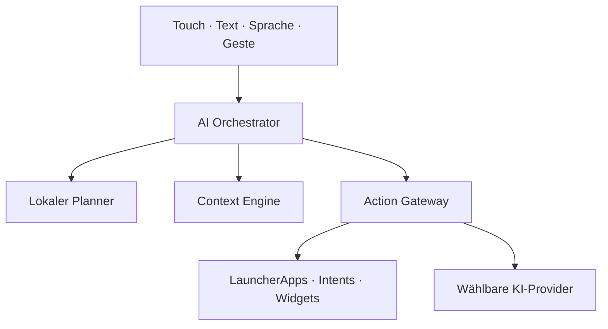
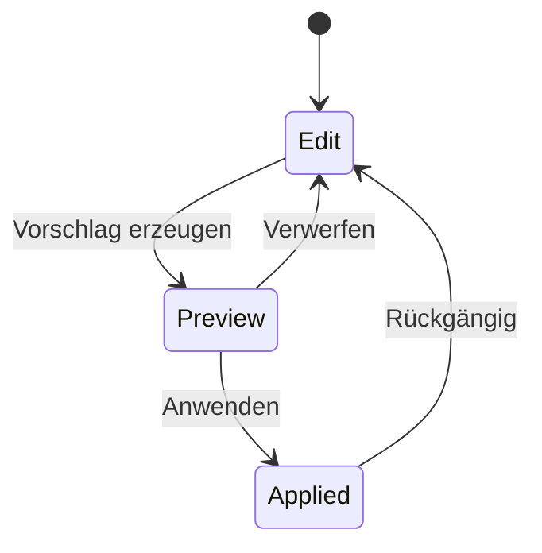

# Architektur

## Leitidee

Der Launcher ist der System-Shell-Kern. KI ist keine einzelne Chat-Seite, sondern ein Orchestrator hinter Eingabe, Kontext, Aktionen und Workspace-Änderungen. Android-Sicherheitsgrenzen bleiben dabei verbindlich.

M1 implementiert `Local`, den privacy-sicheren Teil von `Context` sowie die erlaubten Android-/Provider-Übergaben. Ein generativer Router wird erst ergänzt, wenn Zustimmung, Secret-Speicher und Observability vorhanden sind.

## Gegenwärtige Paketgrenzen

Der erste Build bleibt für zuverlässige CI in einem Android-App-Modul. Die Paketgrenzen entsprechen bereits den späteren Gradle-Modulen:

| Paket | Verantwortung | Späteres Modul |
|---|---|---|
| `model` | unveränderliche Szenen-, Workspace- und App-Modelle | `launcher-core` |
| `data` | App-Katalog und lokaler Workspace-Speicher | `launcher-core` |
| `ai` | Befehlsplanung, Suche, lokale Gruppierung, Providerprofile | `ai-core` |
| `system` | HOME-Rolle, Kontextquellen, Widget-Host-Lebenszyklus | `integrations` |
| `ui` | Compose-Workspace, Drawer, Begleiter, Bestätigungsflächen | `workspace-engine`, `companion`, `creator` |
| `LauncherController` | M1-Orchestrierung und explizite Seiteneffekte | später `orchestrator` |

Die Aufteilung in mehrere Module erfolgt erst, wenn mindestens zwei unabhängige Implementierungen eine Schnittstelle benötigen. So vermeiden wir frühe Modulzeremonie, ohne Zuständigkeiten zu vermischen.

## Vertrauensgrenzen

### App-Erkennung und Start

Startbare Activities werden über `LauncherApps.getActivityList` gelesen und über `startMainActivity` gestartet. Der Launcher verlangt bewusst nicht `QUERY_ALL_PACKAGES`.

### KI-Anbieter

Jeder Anbieter besitzt ein Capability-Profil. M1 unterstützt:

| Fähigkeit | M1 | Verhalten |
|---|---:|---|
| installierte App erkennen | ja | Paket-Hinweis plus sichtbarer App-Name |
| App öffnen | ja | `LauncherApps` |
| Text übergeben | ja | expliziter `ACTION_SEND` nach Nutzertipp |
| Web-Fallback | ja | HTTPS im Standardbrowser |
| direkter API-Aufruf | nein | erst mit Credential Vault und Zustimmung |
| fremde App fernsteuern | nein | bleibt außerhalb der Vertrauensgrenze |

### Workspace-Mutationen

M1 speichert Positionen normalisiert zwischen `0` und `1`, sodass sie sich an unterschiedliche Bildschirmgrößen anpassen. Der momentane Vorschlag ist deterministisch und lokal; die gleiche Sicherheitssequenz wird später auch für LLM-generierte Layouts verwendet.

## Widget-Host

Eine stabile Host-ID und der `AppWidgetHost`-Lebenszyklus existieren bereits. Widget-Auswahl und -Bindung bleiben unsichtbar, bis folgende Invarianten implementiert sind:

1. jede vergebene Widget-ID wird atomar mit dem Workspace gespeichert;
2. abgebrochene Bindungen geben ihre ID wieder frei;
3. Restore/Migration ist getestet;
4. Provider-Fehler können den Launcher nicht blockieren;
5. Löschen und Undo behandeln Widget-ID und Layout gemeinsam.

## Geplante Zielmodule

- `launcher-core`: HOME, App-/Shortcut-Katalog, Profile
- `workspace-engine`: freie Geometrie, Ebenen, Container, Portale
- `ai-core`: Router, Planner, Agenten, Capability Registry
- `integrations`: Intents, Deep Links, Share, Widgets, Systemrollen
- `companion`: Zustände, STT/TTS, Animation, keine Geschäftslogik
- `automation`: Regeln, Trigger, Bestätigung und Audit Log
- `creator`: Action Matrix, Layer-Editor, Themes als Programme

