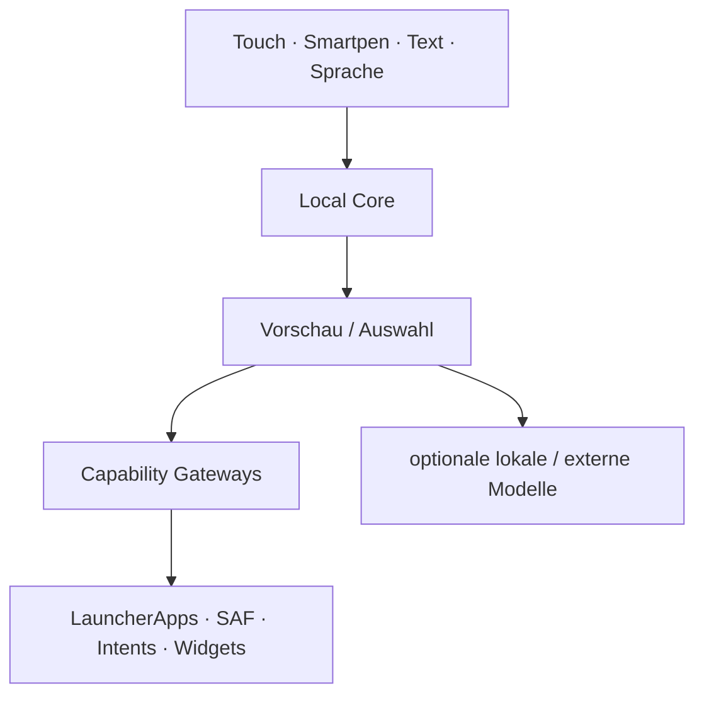
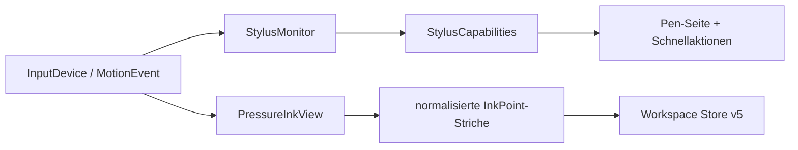
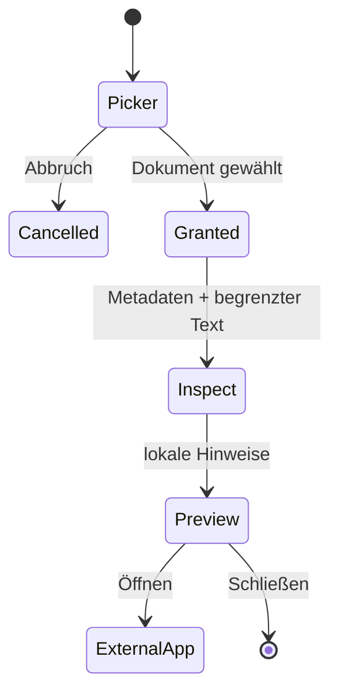
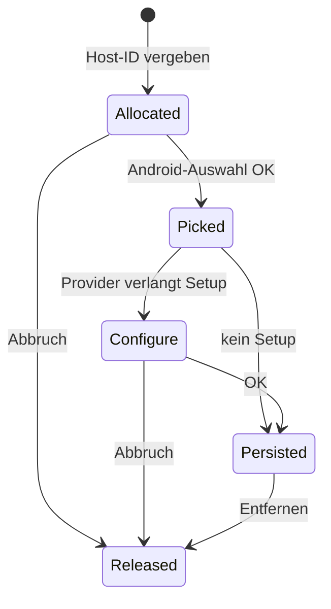
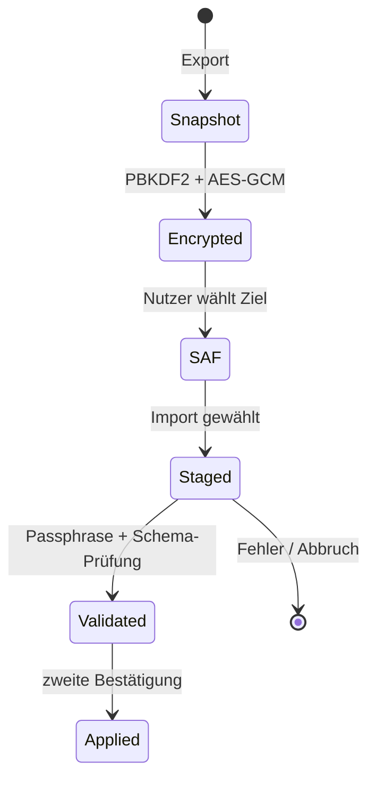
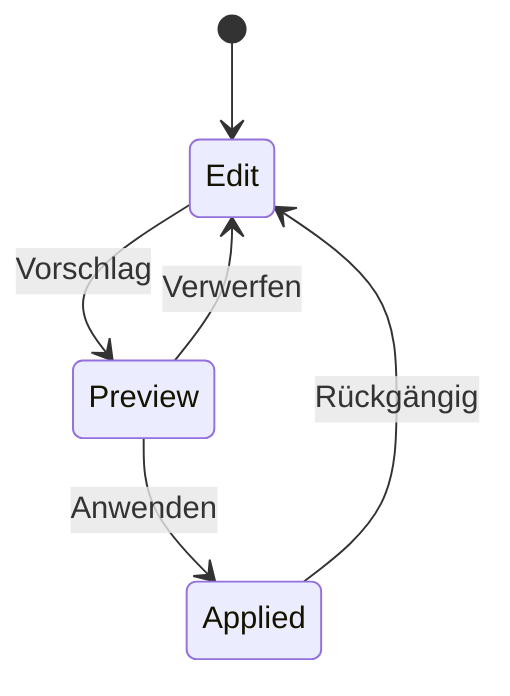

# Architektur

## Leitidee

KoSch ist zuerst eine ausfallsichere Android-HOME-Shell. KI ist ein Orchestrator unter Eingabe, Kontext, Suche, Dateien, Aktionen und Workspace-Mutationen. Fällt ein Modell oder Provider aus, müssen App-Start, Telefon, Dateien, Widgets, Einstellungen und die HOME-Auswahl weiterhin funktionieren.

M2.3 implementiert zusätzlich Pro Desk, Hardware-Keyboard-Routing, sichere Einmalkontakte, verschlüsselten Workspace-Export/Restore, ein metadatenarmes lokales Audit und Widget-Größenpresets. Generative Modelllaufzeiten sind registrierte, aber noch nicht in den HOME-Prozess geladene Erweiterungen.

## Gegenwärtige Paketgrenzen

| Paket | Verantwortung | Vertrauensniveau |
|---|---|---|
| `model` | Workspace-, Professional-, Audit-, Datei-, Shortcut-, Profil-, FAQ-, Stylus- und Ink-Modelle | rein |
| `data` | App-/Shortcut-/FAQ-Katalog, Workspace-Schema v5, Audit, Dock-/Ordner-/Ink- und Widget-Persistenz | lokal |
| `ai` | Befehlsplanung, Suche, Smart-Dock-/Ordner-Klassifikation, Runtime-/Providerprofile | lokal; keine Netzschicht |
| `system` | HOME-Rolle, Kontext, Stylus-Monitor, Dialer/Settings/File-Gateways, Grant-Owner, Badge Listener, Widget Host | Android-Grenze |
| `security` | portabler Backup-Codec, Endpoint-Policy und ruhender Keystore-Vault | Secret-Grenze |
| `ui` | Compose-Shell, Onboarding, Sheets, Neural Glass, Bestätigungen | Darstellung |
| `LauncherController` | explizite Orchestrierung und UI-Zustand | Application Layer |

Ein Modulsplit folgt, sobald der native Modelladapter oder ein optionaler Netzwerkadapter hinzukommt. Besonders `ai-network` darf später als eigener Build Flavor/Modul das `INTERNET`-Recht besitzen; der offline Kern behält es nicht automatisch.

## HOME und Sicherheitsausgang

`RoleManager.ROLE_HOME` öffnet ausschließlich Androids geschützten Rollendialog. Zusätzlich ist `Settings.ACTION_HOME_SETTINGS` im Onboarding und Kontrollzentrum erreichbar. Der Fallback ist `Settings.ACTION_SETTINGS`. KoSch fängt die Zurück-Taste nicht ab, um einen Lock-in zu erzeugen.

## Adaptive Shell und Designsystem

`LauncherRoot` leitet die Darstellung aus den aktuellen `BoxWithConstraints`-Fenstermaßen ab. Kompakte Fenster verwenden eine vertikale Shell; ab 840 dp beziehungsweise ab 720 dp im Querformat werden Navigation und Arbeitsfläche getrennt. Die Entscheidung hängt nicht an einer einmal ermittelten Displayklasse und reagiert deshalb auf Rotation, Multi-Window und Foldable-Resize.

Android 12+ liefert `dynamicDarkColorScheme`; ältere Versionen erhalten die kuratierte KoSch-Palette. Systemleisten bleiben edge-to-edge mit Inset-Schutz. Die Animator-Dauer des Systems steuert den statischen Reduced-Motion-Fallback. Screenshot-, 320-dp-, Hinge- und 200-%-Schrifttests sind noch ein M2.3-Gate.

Ein konservatives `baseline-prof.txt` markiert ausschließlich den nachweislich startkritischen HOME-/Controller-/Store-/Compose-Pfad. Das ist ein Installationshinweis für ART, kein Performance-Beweis. Startzeit, Jank, RSS, Akku und Pen-Latenz bleiben erst nach Macrobenchmark auf realen Geräteklassen bewertbar.

## Pro Desk und Hardware-Tastatur

`ProfessionalHubSurface` ist die Standard-Home-Seite neuer Installationen. Sie aggregiert nur bereits begrenzte Controller-Zustände: HOME-Lage, Local-Core-Status, zugängliche Work-App-Anzahl, Audit-Anzahl, Smart-Dock-Apps und explizite Capability-Einstiege. `ProfessionalShortcutResolver` ist eine reine, unit-getestete Zuordnung. `MainActivity.dispatchKeyShortcutEvent` führt ausschließlich bekannte Aktionen aus; `onProvideKeyboardShortcuts` veröffentlicht sie an Android. Escape schließt über `closeTopSurface` genau den obersten transienten Zustand.

## App-Katalog und Shortcuts

Startbare Activities kommen für jedes zugängliche `LauncherApps.profiles`-Profil aus `LauncherApps.getActivityList`; Apps werden mit `startMainActivity` für den zugehörigen `UserHandle` gestartet. Der stabile App-Schlüssel enthält eine lokale Benutzer-Seriennummer, damit gleichnamige Pakete aus Personal und Work nicht kollidieren. Icons werden über Android gebadgt; Arbeitsprofile erhalten zusätzlich ein sichtbares Label.

M2 liest veröffentlichte dynamische, Manifest- und gepinnte Shortcuts erst nach langem Druck und startet sie mit `LauncherApps.startShortcut`. Der Launcher liest keine privaten Shortcut-Intents und fordert kein `QUERY_ALL_PACKAGES` an. `ACCESS_HIDDEN_PROFILES` bleibt absichtlich undeclared: Ein Private-Space-fähiger Launcher muss einen separaten Container inklusive Hide/Show und Lock/Unlock ohne Metadatenleck anbieten; diese Schutzlogik ist noch nicht vollständig.

## Smartpen und Pen Space

`StylusMonitor` registriert einen `InputManager.InputDeviceListener` und erkennt `SOURCE_STYLUS`, `SOURCE_BLUETOOTH_STYLUS`, `TOOL_TYPE_STYLUS` sowie `TOOL_TYPE_ERASER`. MotionEvents aktualisieren Druck, Neigung, Orientierung, Hover, Werkzeugtyp und Stifttasten mit gedrosselten UI-Samples. Herstellername, Vendor-/Product-ID oder Seriennummer werden nicht persistiert.

`PressureInkView` akzeptiert ausschließlich Stylus-/Eraser-Werkzeuge und ignoriert Fingerkontakte. Druck verändert die Strichbreite; Stift, Marker, Hardware-/Software-Radierer, Hover, Undo und Clear sind lokale Operationen. Striche werden als normierte Vektorpunkte persistiert, begrenzt auf 100 Striche und 2.048 Punkte je Strich. Dadurch bleiben sie bei Resize/Rotation stabil und können keine unbegrenzte Preference-Payload erzeugen.

Systemhandschrift in regulären Compose-Textfeldern bleibt eine Android-14+-IME-Funktion. KoSch behauptet weder eigene OCR noch semantisches Verständnis der Ink-Daten. AndroidX Ink ist eine spätere, benchmarkpflichtige Option, keine versteckte Kernabhängigkeit.

## FAQ und Self-Service

`FaqRegistry` enthält mindestens 40 versionierte, kategorisierte Einträge einschließlich Professional-, Backup-, Kontakt-, Audit- und Recovery-Themen. Die Suche normalisiert Großschreibung, Diakritika und Trennzeichen vollständig lokal. `LocalCommandPlanner` kann diese Arbeitsbereiche ohne Modell öffnen. Die ausführliche Entwickler-/Betriebsfassung liegt in `docs/FAQ.md`.

## Dateien

Die Activity nutzt `ACTION_OPEN_DOCUMENT` über den Activity-Result-Vertrag. `DocumentGrantManager` besitzt höchstens eine persistierte READ-URI-Freigabe: Eine neue Wahl ersetzt die alte, und die Oberfläche kann den Zugriff explizit lösen. `LocalFileIntelligenceEngine` liest Metadaten sowie maximal 4.096 Zeichen aus erkannten Textformaten. Binärdateien werden nicht als Text geraten. M2.3 verändert, löscht oder benennt Dokumente nicht um.

## Telefon und Systemeinstellungen

`SystemActionGateway` kennt nur explizite, dokumentierte Android-Ziele. Telefon verwendet `ACTION_DIAL`, nie `ACTION_CALL`. Die Activity startet eine auf Phone-Daten begrenzte `ACTION_PICK`-Auswahl und setzt auf API 37 den System-Picker-Hinweis; der Controller fragt nur die temporär freigegebene Ergebnis-URI ab. WLAN, Bluetooth, Benachrichtigungen, App-Info, Android-Einstellungen und HOME-Auswahl öffnen Systemoberflächen; Fehler werden sichtbar gemeldet.

## Widgets

`WidgetHostController` besitzt eine stabile Host-ID. Erst nach erfolgreicher Bindung wird die Widget-ID im Workspace Store persistiert. Abbruch und Löschen geben IDs frei. Beim Start werden nicht mehr gültige Records entfernt. M2.3 persistiert die Presets Kompakt, Standard und Hoch und meldet die gewählten Min-/Max-Größen über `AppWidgetHostView.updateAppWidgetSize` an den Provider. Freie Position, Stacks, Restore-Mapping und Undo sind noch nicht fertig.

Die während Androids Picker/Provider-Konfiguration offene Host-ID wird zusätzlich in `onSaveInstanceState` erhalten. Dadurch geht sie bei Activity-Recreation nicht sofort verloren; vollständige Prozess-Tod- und Provider-Restore-Tests bleiben ein M2.3-Gate.

## Backup, Restore und Audit

`WorkspaceStore` serialisiert nur portable Werte. `PortableBackupCodec` authentifiziert Header und Payload; `LauncherController` hält Staging-Daten ausschließlich im Prozess und schützt asynchrone Ergebnisse mit einem monotonen Token. Restore wird nach vollständiger Validierung in einem synchronen Commit angewendet. `LocalAuditLog` verwendet ein geschlossenes Enum-Schema ohne Ziel- oder Freitextdaten, begrenzt Retention/Anzahl und exportiert nur `timestamp_utc,action,outcome`.

## Smart Space, Dock und Ordner

`LocalSmartOrganizer` verarbeitet ausschließlich App-Key, Label, Paketname, lokale Recency, Pinning und aktive Szene. Das Dock setzt manuell gepinnte Apps zuerst, danach lokale Recency und szenenspezifische Kategorien. Ordner werden deterministisch vorgeschlagen und als JSON mit Schema-Version persistiert. Erneutes Organisieren nutzt **Vorschau → Anwenden/Verwerfen**; das erste leere Profil wird lokal mit editierbaren Starter-Sammlungen initialisiert.

App-Shortcut-Abfragen tragen einen monotonen Request-Token. Wechselt die Auswahl oder schließt sich das Sheet, darf ein verspätetes Ergebnis den Zustand nicht mehr überschreiben.

## Notification Dots

`KoSchNotificationListenerService` ist opt-in und durch Androids `BIND_NOTIFICATION_LISTENER_SERVICE` geschützt. Der Launcher kopiert ausschließlich Paketname und Anzahl aktiver, nicht laufender, nicht gruppenzusammenfassender und laut `Ranking.canShowBadge()` badgefähiger Notifications in einen prozesslokalen Zähler. Titel, Text, Extras, Personen und Aktionen werden nicht gespeichert. Ohne erteilten Zugriff ist die Map leer; alle anderen HOME-Funktionen bleiben aktiv.

## Workspace-Mutationen

Positionen sind zwischen `0` und `1` normalisiert. Jede spätere LLM-generierte Mutation muss dieselbe Preview-/Apply-/Undo-Schiene nutzen; direkte Modellschreibrechte am Store sind ausgeschlossen.

## KI-Schichten

| Schicht | M2.3 | Verhalten bei Ausfall |
|---|---:|---|
| KoSch Local Core | aktiv | HOME-Funktionen bleiben deterministisch |
| externe lokale App | optional | Projektseite oder sichtbarer Fehler |
| natives On-Device-LLM | noch nicht gebündelt | Local Core übernimmt |
| Cloud-App/Web | explizite Übergabe | Launcher bleibt lokal |
| direkte API | deaktiviert | kein `INTERNET`-Recht vorhanden |

Die Zielabstraktion `LocalModelBackend` erhält später `load`, `stream`, `cancel`, `unload` und `health`. Modellinferenz darf nicht den UI-/HOME-Prozess blockieren. Geräteprobe, Speicherlimit, Thermalstatus, Modelllizenz und ein hartes Timeout sind Teil des Load-Gates.

## Credential Vault

`SecureCredentialVault` generiert einen nicht exportierbaren AES-256-Schlüssel im Android Keystore und bindet Ciphertexte per GCM-AAD an die Provider-ID. Klartext wird nicht persistiert; übergebene `CharArray`s werden bestmöglich geleert. `ProviderEndpointPolicy` erlaubt Remote-Endpunkte nur per HTTPS und unverschlüsseltes HTTP ausschließlich für explizit aktivierte Loopback-Ziele.

Der Vault ist in M2.3 absichtlich nicht an UI oder Transport gekoppelt. Das lokale Aktionsaudit ist keine Freigabe für Netztransport. Vor Aktivierung direkter APIs fehlen weiter Biometrieoption, Secret-Rotation, Redaction-E2E-Tests, Kontextvorschau, Timeout/Rate Limits und ein separater Netzwerk-Flavour.
